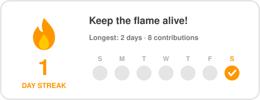

<p align="center">
  
</p>

<!-- TODO: isi link lalu hapus komentar ini
<p align="center">
  <a href="https://YOUR-PORTFOLIO-LINK"></a>
  <a href="https://linkedin.com/in/YOUR-LINKEDIN"></a>
  <a href="https://dribbble.com/YOUR-DRIBBBLE"></a>
  <a href="mailto:YOUR-EMAIL"></a>
</p>
-->

---

### 👋 About me

Product Designer di tim **SPE UIX (Tribe Phoenix)**, fokus di produk **payment & merchant**. Gw kerja di area antara design dan product: mulai dari discovery, ngerapihin problem, sampai handoff ke dev dalam ritme agile/sprint.

- 💳 Currently designing **CRING! Payment** (merchant portal) & **Cring Point**
- 🏦 Products span **FTA BRI**, **FTA DANA**, dan internal merchant portal
- 🧩 Building with the **SPE Nova** design system
- 🤖 Exploring **AI across the full design process**, dari discovery sampai handoff
- 💬 Ask me about: JTBD, friction mapping, heuristic evaluation, output vs outcome vs impact

---

### 🛠️ What I do

| Discover | Define | Design | Deliver |
|:--|:--|:--|:--|
| User interview, JTBD, competitive benchmark | Friction map, HMW, assumption mapping | User flow, IA, wireframe → hi-fi UI | Design system components, dev handoff, usability testing |

---

### 📂 Featured work

> Case study detail ada di portfolio. Ini ringkasannya.

**💳 CRING! Payment — Merchant Portal**
Redesign & analisis fitur merchant portal: friction di **Transfer Dana**, **Dashboard & Insight**, filter **Virtual Account**, dan **Management User & Role**.

**🧮 Fee Management & Revenue Calculation**
End-to-end design cycle untuk perhitungan fee & revenue transaksi QRIS.

**🗓️ Disbursement & Riwayat Transfer Dana**
Redesign timing jadwal disbursement VA dan perbaikan riwayat transfer dana biar lebih gampang direkonsiliasi.

**📊 Escrow Monitor — Financial Health Dashboard**
Dashboard monitoring escrow untuk role Rekonsiliator.

**📍 Cring Point — Transaction & Reservation**
Research initiative untuk List Transaksi & Kalender, Transaksi Langsung, dan Reservasi: validasi pain point sebelum solusi.

**🔍 QRIS Create Flow Benchmark**
Benchmark flow pembuatan QRIS statis vs dinamis untuk nentuin arah desain.

---

### 🤖 Side project: AI-assisted design workflow

Gw bikin **sistem skill modular** buat AI yang ngejalanin design cycle **Brief → Think → Make → Check**, dan langsung nge-inject artefaknya ke board FigJam.

```
/pre-cycle-brief   → business & user context, success criteria
/ritual            → JTBD, friction map, HMW, user flow, testing plan
/ux-orchestration  → full cycle (Lite / Standard / Full) → doc dev siap handoff
```

---

### 🧰 Toolkit

<p>
  
  
  
  
  
  
  
  
</p>

---

### 🔥 Consistency

<p align="center">
  
</p>

---

<p align="center"><sub>Designing with intent, shipping with care. ✌️</sub></p>
